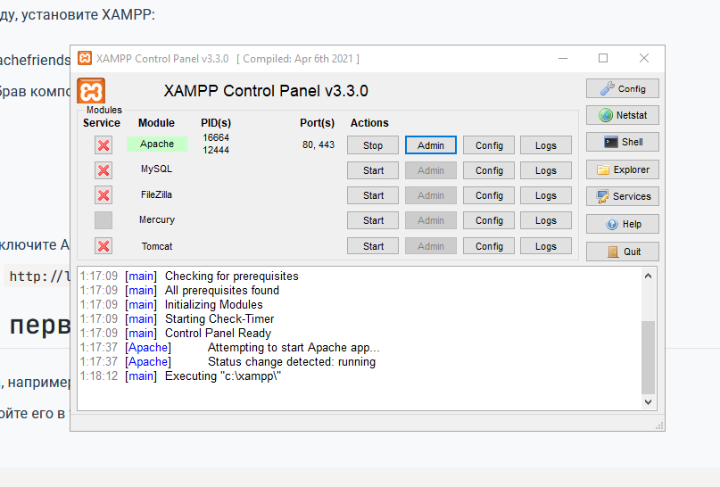
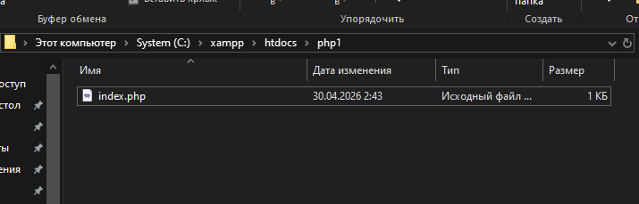
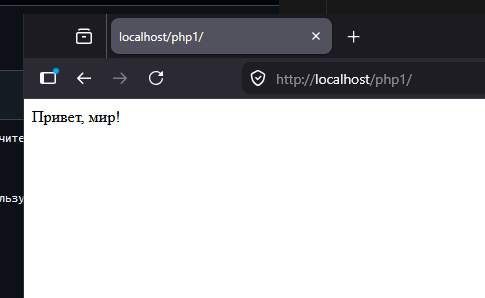
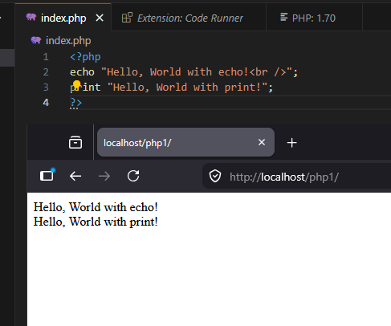
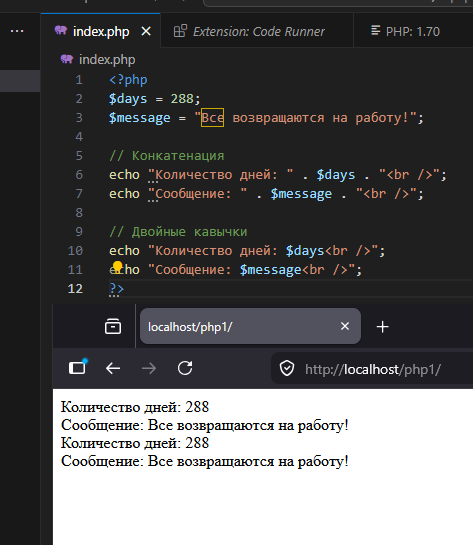

Запустите XAMPP Control Panel и включите Apache.

___________________________________________________________________

Создайте директорию для проекта

___________________________________________________________________

Запустите программу

___________________________________________________________________

Выведите строку "Hello, World!" используя функцию echo и print

___________________________________________________________________

Работа с переменными и выводом

___________________________________________________________________

Какие способы установки PHP существуют?

      Ручная установка PHP + Apache,
  
      XAMPP, OpenServer

___________________________________________________________________

Как проверить, что PHP установлен и работает?

      открыв http://localhost в браузере.

___________________________________________________________________

Чем отличается оператор echo от print?

    echo может выводить несколько строк
    print возвращает значение (1)
        работает как функция
